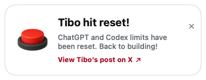

# Tibo, We Love You

A tiny macOS menu bar app that lets you know when Tibo posts a ChatGPT or
Codex limit reset.

> Unofficial fan-made utility. Not affiliated with Tibo, X, or OpenAI.



## Download

[Download the latest macOS build](https://github.com/Tiaivy/tibo-we-love-you/releases/latest/download/TiboWeLoveYou-macOS.zip)

Requires macOS 13 or later.

1. Download and unzip `TiboWeLoveYou-macOS.zip`.
2. Move `TiboWeLoveYou.app` to Applications.
3. On first launch, right-click the app and choose **Open**.

The app is ad-hoc signed but not Apple-notarized, so macOS may ask you to
confirm it in **System Settings → Privacy & Security**.

## What it does

- Lives quietly in the macOS menu bar.
- Watches a shared central feed for new posts from `@thsottiaux`.
- Alerts only when a post clearly confirms a completed ChatGPT or Codex
  allowance reset.
- Shows a compact, silent red-button animation in the top-right corner.
- Keeps the alert visible until you close it or open the original post on X.
- Never ships the TwitterAPI.io key inside the Mac app.

## Shared API architecture

The central Cloudflare Worker checks `@thsottiaux` at most once every 10
minutes, for a maximum of 144 upstream TwitterAPI.io requests per day. Every
installed app reads the same cached result, so adding more users does not
multiply TwitterAPI.io usage.

The Mac app polls the
[shared feed](https://tiboweloveyou-feed.tiboweloveyou.workers.dev/v1/reset/latest)
once per minute. The TwitterAPI.io key stays in Cloudflare and is never shipped
inside the app. Server code and deployment instructions are in
[`Server/`](Server/).

## Reset detection rules

A post must satisfy every rule below before an alert is published:

1. It comes from `@thsottiaux`.
2. It is an original post, not a reply, repost, or quote.
3. It mentions ChatGPT or Codex.
4. It includes allowance context such as usage limits, weekly limits, or quota.
5. It clearly states that the reset has already happened.

Scheduled, uncertain, negated, hypothetical, and question-form posts are
rejected. A standalone `reset` keyword is never enough to trigger an alert.

## Build

Deploy the central Worker first, then build the Mac app with its public feed
URL:

```bash
TIBO_RESET_FEED_URL="https://your-worker.example/v1/reset/latest" \
  ./scripts/build_app.sh
```

Build outputs:

```text
dist/TiboWeLoveYou.app
dist/TiboWeLoveYou-macOS.zip
```

Do not publish a build with an empty `TIBO_RESET_FEED_URL`.
